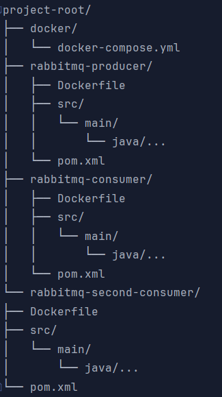

# RabbitMQ Simple Example Project

This project demonstrates how to use the RabbitMQ message broker with the following three services such as: producer,
consumer and secondary consumer. The purpose of this program is a simple example with one producer and two consumers
work with messages, queues, sending and receiving.

## Structure of the project



### Explanation of structure

- **docker/**: Includes configuration file `docker-compose.yml` that describe all services and run 
    application with Docker. localhost:15672
- **rabbitmq-producer/**: Includes code and configuration for producer service that generates messages to
    several queues (queue and parallel sending). localhost:8080
- **rabbitmq-consumer/**: Includes code and configuration for consumer that receives answers(messages) 
    from RabbitMQ service. localhost:8081
- **rabbitmq-second-consumer/**: Same with rabbit-consumer service. localhost:8082

### Commands to Run

    ```bash
    cd docker
    docker-compose up --build
    ```
    
    This command build Docker images to all services and will run them. 

### How to check working
    
    Open browser: Input for RabbitMQ management: [http://localhost:15672](http://localhost:15672)
    Go to the Postman:
    post request - http://localhost:8080/api/v1/send/first-queue
        Body -> raw -> write some text(message) - it's for first queue
    post request - http://localhost:8080/api/v1/send/second-queue
        Body -> raw -> write some text(message) - it's for second queue
    post request - http://localhost:8080/api/v1/send/manually?queueName=QueueForFistConsumerTransient
        Body -> raw -> write some text(message) - it's for manually queue
    post request - http://localhost:8080/api/v1/send/fanout-exchange
        Body -> raw -> write some text(message) - it's for both queue

    In the logs (Docker or IDEA terminal) we can use all messages.

## Technologies Used

### 1. Docker and Docker Compose
- **Docker** allows each component to run in separate containers, simplifying environment setup and management.
- **Docker Compose** is used to launch all necessary services simultaneously, including Zookeeper, Kafka, and
- the Office and Plane microservices.

### 2. Spring Boot (Backend)
- Each service (Office and Plane) is built with **Spring Boot** for rapid development and scalability. JDK 22.
- **RabbitMQ** is integrated via the `spring-boot-starter-amqp` library, enabling easy sending and receiving of messages between services.
- Lightweight libraries such as **Lombok** are used to reduce boilerplate code.

### 3. RabbitMQ
- **RabbitMQ** is a messaging system for processing and transmitting messages between services.

## Good luck to everyone
